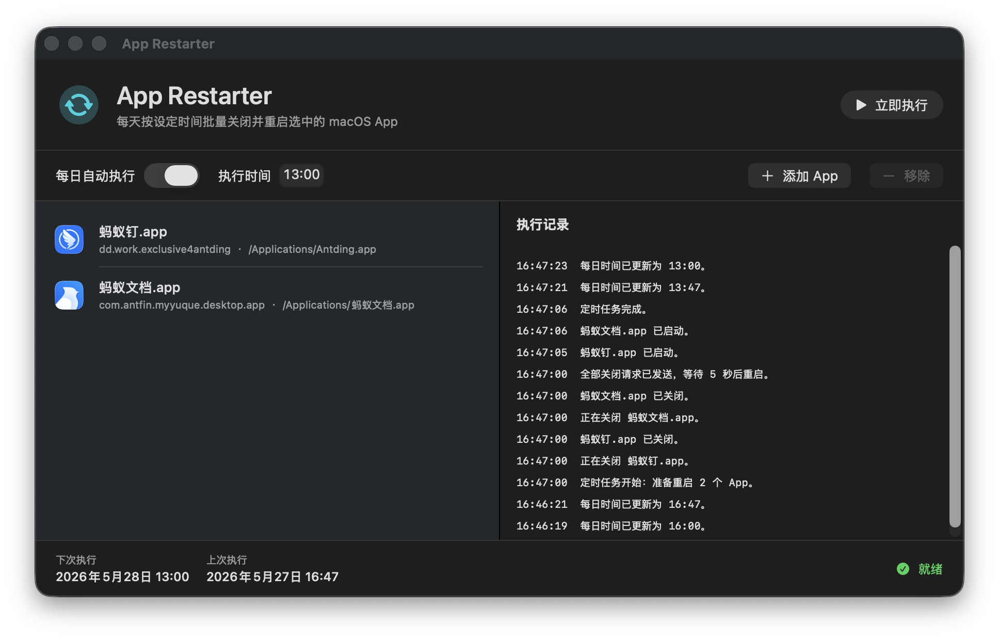
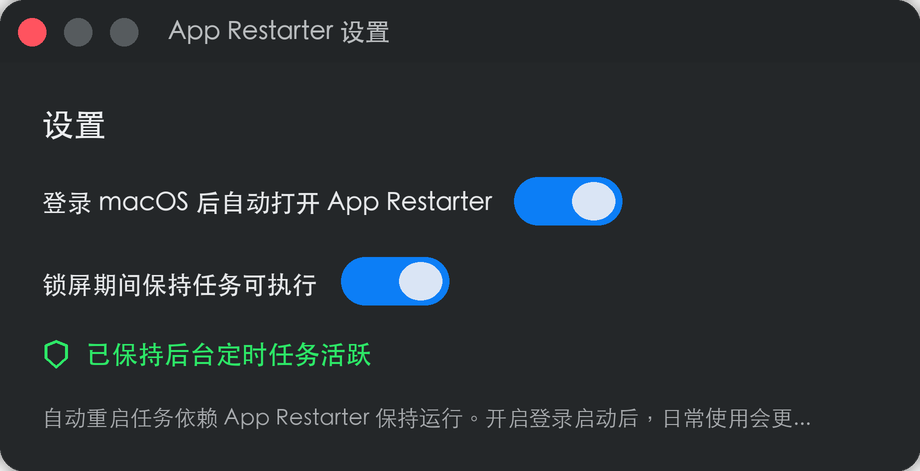

# App Restarter

App Restarter 是一个基于 SwiftUI 实现的 macOS Native App，用于批量管理指定应用，并在每天固定时间自动关闭、等待 5 秒后重新启动。默认执行时间为每天 13:00。



## 功能特性

- 批量选择本机 `.app` 应用。
- 默认每天 13:00 自动执行重启任务。
- 支持自定义每日执行时间。
- 支持手动点击“立即执行”进行一次性重启。
- 自动记录每次关闭、等待、启动的执行日志。
- 支持设置“登录 macOS 后自动打开 App Restarter”。
- 关闭窗口后自动隐藏 Dock 图标，最小化到状态栏（菜单栏）。
- 状态栏菜单支持快速操作：显示主窗口、立即执行、打开设置、退出。
- 支持锁屏期间保活，推荐开启，让用户会话锁定时仍能按时执行重启任务。

## 操作指引

1. 打开 App Restarter。
2. 点击“添加 App”，在弹出的文件选择器中选择一个或多个需要管理的 `.app`。
3. 确认“每日自动执行”开关已开启。
4. 在“执行时间”中设置每天触发的时间，默认是 13:00。
5. 到达设定时间后，App Restarter 会依次关闭已选择的 App。
6. 所有关闭请求发出后等待 5 秒。
7. 5 秒后自动重新启动这些 App。
8. 如需立即测试，可点击右上角“立即执行”。
9. 关闭窗口后，App 会自动隐藏 Dock 图标，仅保留顶部状态栏图标。
10. 通过状态栏图标可以随时重新打开主窗口或执行其他操作。
11. 如需锁屏期间继续执行，打开设置并确认“锁屏期间保持任务可执行”已开启。

## 推荐设置

建议在设置页打开这两个开关：

- “登录 macOS 后自动打开 App Restarter”
- “锁屏期间保持任务可执行”

这样 App Restarter 会在日常使用中保持后台运行。比如把执行时间设为每天 13:00，中午吃饭前锁屏离开电脑，它就可以在后台依次关闭并重启钉钉、语雀、浏览器、IDE 等大内存 App，等你回来时这些应用已经完成刷新。



## 构建与运行

```bash
cd AppRestarter
./Scripts/build-app.sh
open dist/AppRestarter.app
```

构建完成后，产物会生成在：

```text
dist/AppRestarter.app
```

## 执行规则

- 如果目标 App 正在运行，会先发送正常退出请求。
- 如果目标 App 短时间内没有退出，会尝试强制关闭。
- 如果目标 App 本来没有运行，会跳过关闭步骤，并在 5 秒后启动。
- 执行记录会展示在右侧“执行记录”区域，方便排查是否成功。
- 开启锁屏保活后，App 会通过 macOS 后台活动机制防止空闲睡眠暂停定时器。
- 如果设备曾因睡眠等原因错过当天定时任务，App 恢复运行后会补跑当天任务。

## 注意事项

- 定时任务依赖 App Restarter 本身保持运行。关闭窗口不会退出应用，App 会在状态栏后台继续工作。
- 如果希望完全退出，请通过状态栏菜单点击"退出 App Restarter"。
- 如果希望每天稳定执行，建议在设置中开启登录启动。
- 锁屏保活适用于“用户仍登录、只是锁屏”的场景；关机、注销、强制系统睡眠或合盖睡眠期间无法执行。
- 锁屏保活会防止空闲系统睡眠，笔记本电池场景可能带来额外耗电。
- App Restarter 只适用于 macOS，iOS 不允许普通 App 管理其他 App 的启动和关闭。
- 某些受系统保护、需要特殊权限或有后台守护机制的 App，可能无法被完全关闭。
